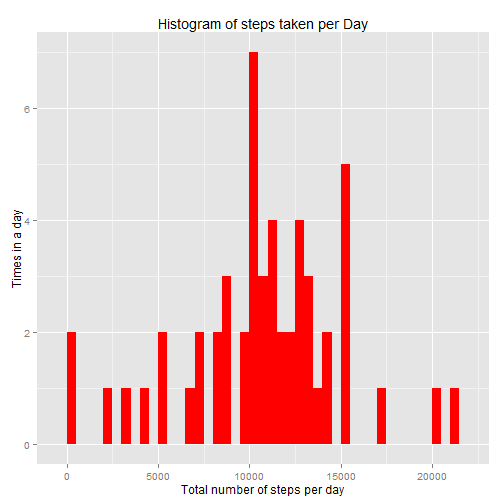
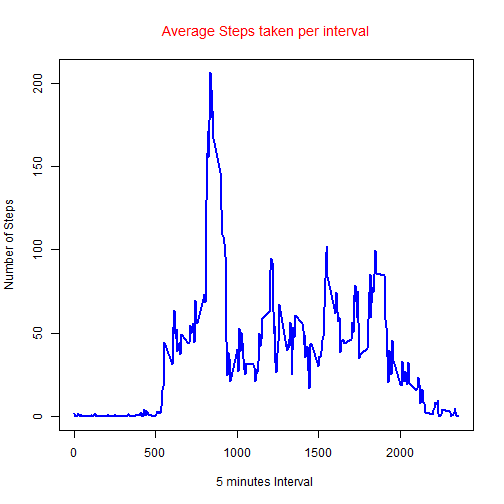
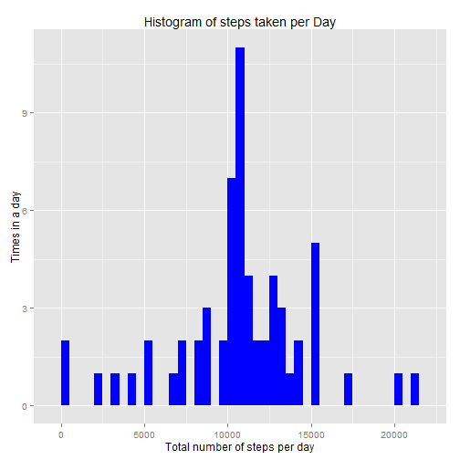
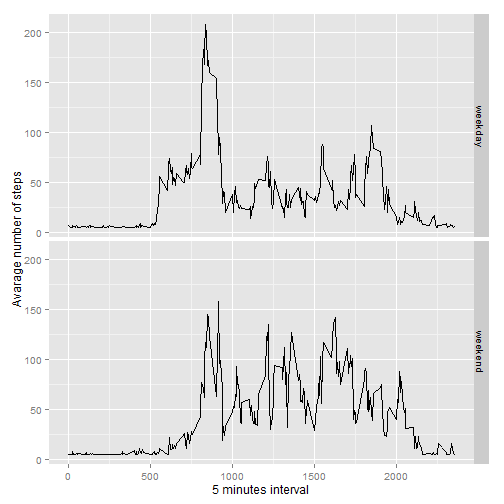

Assignment

This assignment will be described in multiple parts. You will need to write a report that answers the questions detailed below. Ultimately, you will need to complete the entire assignment in a single R markdown document that can be processed by knitr and be transformed into an HTML file.Assignment

This assignment will be described in multiple parts. You will need to write a report that answers the questions detailed below. Ultimately, you will need to complete the entire assignment in a single R markdown document that can be processed by knitr and be transformed into an HTML file.

###Loading data

```r
dataset_dir <- "~/repdata"
data_file <- paste(dataset_dir, "/activity.csv", sep = "")
act_data <- read.csv(data_file, header = TRUE, sep = ",",
                     colClasses = c("numeric", "character","numeric"))

act_data$date <- as.POSIXct(act_data$date)
```

##1. Find the mean total number of steps taken per day?

Dataset without NA value - act_data


```r
head(act_data)
```

```
##   steps       date interval
## 1    NA 2012-10-01        0
## 2    NA 2012-10-01        5
## 3    NA 2012-10-01       10
## 4    NA 2012-10-01       15
## 5    NA 2012-10-01       20
## 6    NA 2012-10-01       25
```

Total steps taken per day, it does not include NA values

```r
    total_steps <- aggregate(steps ~ date, data = act_data, sum, na.rm = TRUE)
    suppressMessages(library(ggplot2))
```

Histogram of total steps taken per day

```r
ggplot(total_steps, aes(x = steps)) + 
        geom_histogram(fill = "red", binwidth = 500) + 
        labs(title="Histogram of steps taken per Day", 
        x = "Total number of steps per day", y = "Times in a day") 
```

 

Mean and Median steps taken per day


```r
    average_steps <- mean(total_steps$steps)
    print(average_steps)
```

```
## [1] 10766.19
```

```r
    median_steps <- median(total_steps$steps)
    print(median_steps)
```

```
## [1] 10765
```

##2. The average daily activity pattern


```r
    #Steps per interval
    steps_interval <- aggregate(act_data$steps, data = act_data, FUN=mean, 
                                by = list(act_data$interval), na.rm = TRUE)

    #Calculate and report the mean and median of the total number of steps taken per day
    steps_mean   <- mean(total_steps$steps, na.rm=TRUE)
    steps_median   <- median(total_steps$steps, na.rm=TRUE)
```

Plot for average steps per interval


```r
    x_interval <- steps_interval[,1]
    y_num_steps <- steps_interval[,2]

    plot(x_interval,y_num_steps, type = "l", ylab = "Number of Steps", 
        xlab = "5 minutes Interval ")
    title(main="Average Steps taken per interval", font.main=1, col.main = 'Red')
    lines(x_interval,y_num_steps, col='Blue', lwd=2)
```

 

Find the max steps per interval


```r
    max_step_interval <- steps_interval[which.max(steps_interval[,2]),]
    print(max_step_interval)
```

```
##     Group.1        x
## 104     835 206.1698
```
Max average steps is 206 at 835(8:35AM) daily

##3. Imputing missing values


```r
#Checking the missing value
    na <- act_data$steps
    mean(is.na(na))
```

```
## [1] 0.1311475
```
Missing Values is about 13%


```r
    ## Install packages Hmisc, use the function impute to fill NA values 
    suppressMessages(library(Hmisc))
```

Fill in all of the missing values in the dataset(steps) with mean values of the day


```r
    act_data2 <- act_data
    act_data2$steps <- with(act_data2, impute(steps, mean))
```

Verify there is no NA value

```r
    na <- act_data2$steps
    mean(is.na(na))
```

```
## [1] 0
```
[1] 0 -> confirmed, there is no NA value


New dataset - act_data2 with the filled-in missing values


```r
head(act_data2)
```

```
##     steps       date interval
## 1 37.3826 2012-10-01        0
## 2 37.3826 2012-10-01        5
## 3 37.3826 2012-10-01       10
## 4 37.3826 2012-10-01       15
## 5 37.3826 2012-10-01       20
## 6 37.3826 2012-10-01       25
```

Histogram of total steps taken per day, after filling NA value

```r
    total_steps1 <- aggregate(steps ~ date, data = act_data2, sum)

    ggplot(total_steps1, aes(steps)) + 
        geom_histogram(fill = "blue", binwidth = 500) + 
        labs(title="Histogram of steps taken per Day", 
        x = "Total number of steps per day", y = "Times in a day") 
```

 

###Report the mean and median total number of steps taken per day.

Before fill NA value

```r
    steps_mean   <- mean(total_steps$steps, na.rm=TRUE)
    print(steps_mean)
```

```
## [1] 10766.19
```

```r
    steps_median   <- median(total_steps$steps, na.rm=TRUE)
    print(steps_median)
```

```
## [1] 10765
```
   
After fill NA value

```r
    steps_mean1   <- mean(total_steps1$steps, na.rm=TRUE)
    print(steps_mean1)    
```

```
## [1] 10766.19
```

```r
    steps_median1 <- median(total_steps1$steps, na.rm=TRUE)
    print(steps_median1)
```

```
## [1] 10766.19
```
After fill NA value, the mean and median value is same 10766.19

##4. Find the differences in activity patterns between weekdays and weekends.

Create a new factor for Weekend or Weekday and Calculate average step per 5 minutes internval

```r
    weekends <- c("Saturday", "Sunday")
    act_data2$daytype <- as.factor(ifelse(weekdays(act_data2$date) %in% weekends,"Weekends","Weekdays"))
    ave_steps_inv <- aggregate(steps ~ interval + daytype, act_data2, mean)
```
Plot to compare Weekdays vs Weekends

```r
    ggplot(ave_steps_inv, aes(interval, steps)) + 
        geom_line() + 
        facet_grid(daytype ~ .) +
        xlab("5 minutes interval") + 
        ylab("Avarage number of steps")
```

 

The graph above shows the activity on the weekday has the greatest peak from average steps per 5 minutes interval (before 10:00AM). But the weekends activities have more peaks over a hundred spread out over the day compare to weekdays 
This could be due to the fact that activities on weekdays mostly a work related, while activities in weekend may related to outdoor activities or sports.

